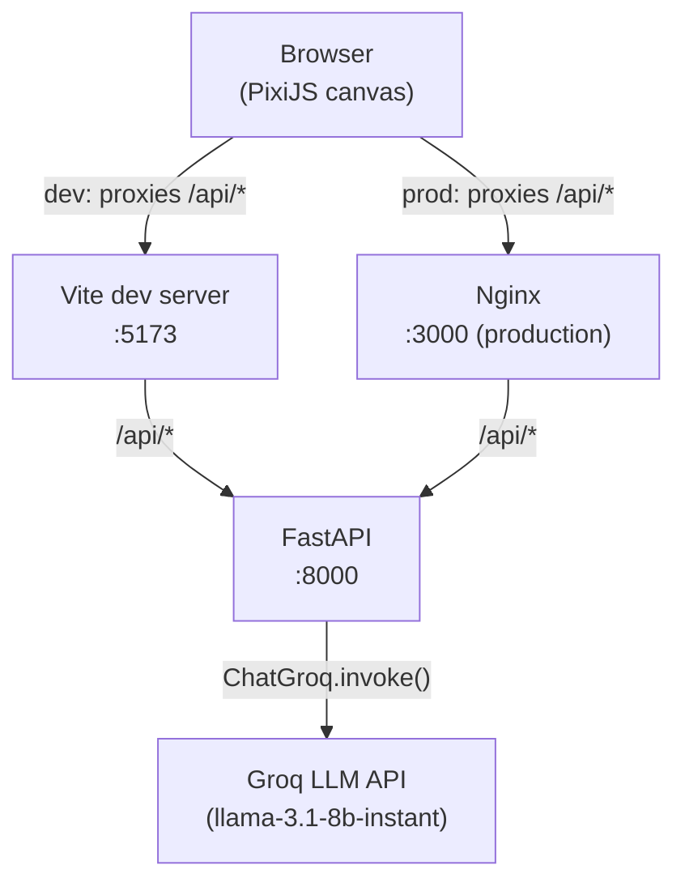
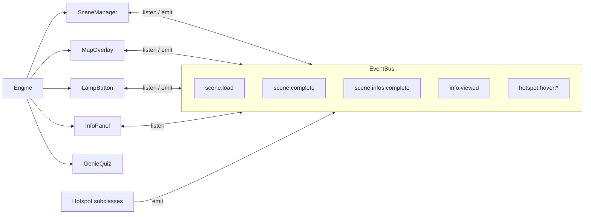

# Riverwise

Riverwise is a 2D educational exploration game designed to build ecological literacy about river catchments. Players navigate between interconnected scene nodes — a town, a coffee shop, and a riverside — interacting with hotspots to discover ecological information and completing Genie-led quizzes to mark each scene as understood. All scene content is defined in JSON config files, meaning educators can update locations, information cards, and quiz questions without touching application code.

The project is a full-stack monorepo: a TypeScript/PixiJS front-end client served by Nginx, and a Python/FastAPI back-end that proxies requests to a Groq LLM for adaptive AI-generated responses.

---

## Repository structure

```
capstone/
├── client/               # Vite + PixiJS front-end
│   ├── src/
│   │   ├── config/       # scenes.json, map.json — all game content lives here
│   │   ├── core/         # Engine, SceneManager, EventBus, InputManager
│   │   ├── objects/      # Scene, Hotspot subclasses, HotspotFactory
│   │   ├── ui/           # InfoPanel, GenieQuiz, LampButton, MapOverlay
│   │   └── types/        # TypeScript schemas for all config shapes
│   ├── public/assets/    # SVG sprites, backgrounds, map icons
│   ├── Dockerfile
│   └── nginx.conf
├── server/               # FastAPI back-end + task-specific AI functions
│   ├── app/
│   │   ├── ai/           # Prompt builders, shared LangChain caller
│   │   └── config/       # ConfigManager, Pydantic config models
│   ├── config/
│   │   └── config.yaml   # LLM model selection and system prompt
│   ├── Dockerfile
│   └── main.py
├── docker-compose.yml
└── .gitignore
```

---

## System architecture



Within the client, all subsystems communicate through a central event bus rather than holding direct references to each other:



---

## Prerequisites

| Tool | Version | Required for |
|------|---------|--------------|
| Node.js | 22+ | Client development |
| npm | bundled with Node | Client dependencies |
| Python | 3.12+ | Server development |
| `uv` | latest | Python dependency management |
| Docker + Compose | latest | Full-stack container run |

Install `uv` if not already present:

```bash
curl -LsSf https://astral.sh/uv/install.sh | sh
```

---

## Quick start — Docker Compose

Running the entire stack with a single command is the recommended path for reviewing the project or for handover testing.

```bash
# 1. Copy and fill in the environment file
cp server/.env.example server/.env
# Edit server/.env — set GROQ_API_KEY to a valid key from console.groq.com

# 2. Build and start
docker compose up --build
```

| Service | URL |
|---------|-----|
| Client (Nginx) | http://localhost:3000 |
| Server (FastAPI) | http://localhost:8000 |
| API health check | http://localhost:8000/health |

Stop everything with `docker compose down`.

---

## Quick start — local development

For active development, run the client and server in separate terminals so both support hot-reload.

**Terminal 1 — server:**

```bash
cd server
cp .env.example .env       # fill in GROQ_API_KEY
uv sync                    # install Python dependencies
uv run uvicorn app.api:app --reload --host 0.0.0.0 --port 8000
```

**Terminal 2 — client:**

```bash
cd client
npm install
npm run dev                # starts at http://localhost:5173
```

The Vite dev server is pre-configured to proxy all `/api/*` requests to `http://localhost:8000`, so the client and server work together out of the box without any CORS configuration changes.

For full details, see [client/README.md](client/README.md) and [server/README.md](server/README.md).

---

## Environment variables

| Variable | File | Default | Description |
|----------|------|---------|-------------|
| `GROQ_API_KEY` | `server/.env` | — | API key from [console.groq.com](https://console.groq.com). Required for real LLM responses. |
| `CORS_ORIGINS` | `server/.env` | `http://localhost:3000,http://localhost:5173` | Comma-separated list of allowed front-end origins. |
| `LOG_LEVEL` | `server/.env` | `INFO` | Server log verbosity (`DEBUG`, `INFO`, `WARNING`, `ERROR`). |

Copy `server/.env.example` to `server/.env` and set at minimum `GROQ_API_KEY`. The file is git-ignored and must never be committed.

---

## How to update content

Content updates do not require touching application logic. The key files are:

| What to change | File |
|----------------|------|
| Scene backgrounds, hotspot positions, info card text, quiz questions | [`client/src/config/scenes.json`](client/src/config/scenes.json) |
| Map layout, node positions, node icons | [`client/src/config/map.json`](client/src/config/map.json) |
| SVG sprites and background artwork | [`client/public/assets/`](client/public/assets/) |
| LLM model selection and sampling parameters | [`server/config/config.yaml`](server/config/config.yaml) |
| AI tutor system prompt (tone, structure, grade level) | [`server/config/config.yaml`](server/config/config.yaml) under `prompts_config.system_prompt` |

Step-by-step guides for adding scenes, hotspots, and assets are in [client/README.md](client/README.md). The system prompt template syntax and model swap instructions are in [server/README.md](server/README.md).

---

## Deployment notes

**`ENGINE_DEBUG`** is currently hardcoded to `true` in `client/vite.config.ts`. This renders coloured hit-area outlines over every hotspot and logs all event bus traffic to the browser console. Set it to `false` before deploying to production:

```ts
// client/vite.config.ts
define: {
  ENGINE_DEBUG: JSON.stringify(false),
}
```

**Real LLM integration:** The server currently responds to `POST /api/dummy-invoke` with a stub that echoes the prompt. To wire up the real AI model, follow the instructions in [server/README.md](server/README.md) under *Swapping the stub for the real LLM*.

**Docker Compose ports:**

| Service | Internal port | Exposed port |
|---------|--------------|--------------|
| `client` | 3000 | 3000 |
| `server` | 8000 | 8000 |

In a real deployment the client container (Nginx) is the only public-facing service; the server should sit behind a private network and only be reachable via the Nginx proxy.
